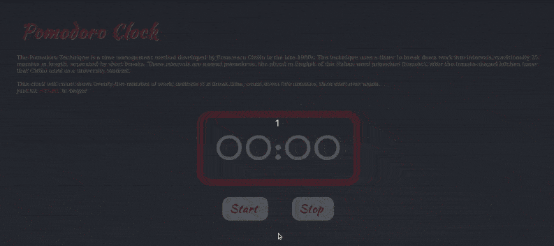

# Pomodoro
This app is a time management tool using the Pomodoro Technique. It was developed by Francesco Cirillo in the late 1980s. The technique uses a timer to break down work into intervals, traditionally 25 minutes in length, separated by short breaks.

I created this project for a few reasons, I wanted to:
- Show my growth since the last time I created a pomodoro
- Focus on accessibility
- Practive with Vue

## Features
- Built with Vue.js
- Easy to read visual timer 
- Alert messages based on time reached
- Local session storage of timer state (the app continues to function even when page is refreshed)
- Conditional play, pause, and reset buttons
- Calm, minimilist design
- Responsive sizing
- Screen reader friendly
- Sufficiently high contrast
- Alternative message for JavaScript disabled users

## Screenshots

### Version 2

### Version 1

## Getting Started
It's very vanilla; simply download the project and run the index.html file in your browser